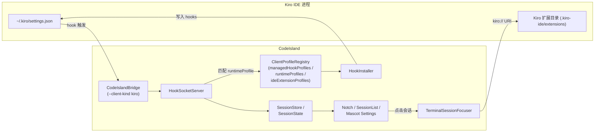

# Design Document

## Overview

Kiro 是 AWS 推出的、基于 VS Code 内核的 AI IDE，原生支持 hooks 协议且兼容 Claude Code 的事件命名（`PreToolUse` / `PostToolUse` / `Notification` / `Stop` / `PreCompact` 等）。本设计的目标是把 Kiro 作为新的受管客户端接入 CodeIsland，让其享有与 Cursor / VS Code / CodeBuddy / Qoder 同级的待遇：

- 出现在「钩子集成」设置中，可一键安装 / 卸载到 `~/.kiro/settings.json`
- Bridge 在转发事件时正确标记 `client-kind=kiro`，运行时识别出 Kiro 会话并显示 "Kiro" 徽标
- 在「客户端宠物」设置中拥有专属宠物形象与默认映射
- 设置面板与会话列表使用打包的 `KiroLogo` 资源
- 安装 Code Island IDE 扩展后支持「点击会话跳回 Kiro 终端」的精准聚焦

整个改动严格遵循 AGENTS.md 「If you add a Claude-compatible hook client, start in `CodeIsland/Models/ClientProfile.swift`」的路由规则——绝大部分逻辑通过往三张静态注册表追加条目即可完成，不引入新架构、不新增分支文件。

### 核心研究结论

- **Kiro 的 hook 协议**：Kiro 的 hooks 实现复用了 Claude Code 的 JSON 格式（`PreToolUse` / `PostToolUse` / `Notification` / `Stop` / `SessionStart` / `SessionEnd` / `SubagentStop` / `PreCompact` / `PermissionRequest` / `UserPromptSubmit`，matcher 使用 `*` 风格），所以 `bridgeSource` 直接复用 `"claude"`，bridge 通过 `--client-kind kiro` 让上游识别。这与 Cursor / CodeBuddy / Qoder 的接入方式一致。
- **配置文件位置**：Kiro 用户级配置位于 `~/.kiro/settings.json`，对应 `installationKind = .jsonHooks`。该路径是用户主目录下的纯 JSON 文件，落入 `HookInstaller` 现有的 JSON hook 安装分支即可，无需新增 `pluginFile` / `pluginDirectory` / `hookDirectory` 处理逻辑。
- **VS Code 扩展兼容性**：Kiro 与 VS Code / Cursor / CodeBuddy / Qoder 共用 VS Code 扩展结构。`IDEExtensionInstaller` 已经基于宿主 `product.json` 中的 `dataFolderName` 自动定位扩展目录，因此只需提供回退路径 `.kiro-ide/extensions` 与 URI scheme `kiro://`，无需新增安装逻辑。
- **品牌色与宠物**：Kiro 官方品牌色偏紫蓝渐变。沿袭仓库中其它客户端「单色像素吉祥物」的风格，新增 `MascotKind.kiro`，独立 `drawKiro` 渲染方法与 `alertColor`，与现有 11 个 MascotKind 的 RGB 至少有一个通道差异 ≥ 0.05。

## Architecture

整体架构沿用现有 hook 客户端接入路径，本次改动是横向扩展，不调整数据流或服务边界。



关键变更点：

1. **`CodeIsland/Models/ClientProfile.swift`** 三张静态数组分别新增条目：
   - `managedHookProfiles` 增加 `kiro-hooks`，写入 `~/.kiro/settings.json`
   - `runtimeProfiles` 增加 `kiro`，把 `--client-kind kiro` 的 envelope 解析为 Kiro 徽标
   - `ideExtensionProfiles` 增加 `kiro-extension`，复用 VS Code 风格扩展安装与 `kiro://` URI 聚焦
2. **`CodeIsland/Models/SessionProvider.swift`** 的 `SessionClientBrand` 枚举追加 `.kiro`
3. **`CodeIsland/UI/Components/MascotView.swift`** 的 `MascotClient` / `MascotKind` 枚举追加 `.kiro`，并在 `MascotClient.init(clientInfo:provider:)` 的 profileID 与 brand 路由分支中加入 `.kiro`；新增 `drawKiro(...)` 渲染方法
4. **`CodeIsland/Assets.xcassets/KiroLogo.imageset/`** 新增 `Contents.json` + `kiro-logo.png`
5. **`CodeIslandTests/`** 在 `ClientProfileIconTests` 与新增的 `KiroIntegrationTests` 中加入断言（无需新增机制，照搬 `GeminiIntegrationTests` / `OpenCodeIntegrationTests` 的模式）

不需要修改：`HookInstaller`（`.jsonHooks` 分支已覆盖）、`HookSocketServer`（`matchRuntimeProfile` 已经可以基于 `recognizedKinds` 命中新 profile）、`TerminalSessionFocuser`（`focusWithExtension` 已通过 `ManagedIDEExtensionProfile.uriScheme` 通用化）、`SessionStore` / `SessionMonitor` / Notch UI（均通过 `SessionClientInfo` 抽象消费品牌信息）。

## Components and Interfaces

### 1. `ManagedHookClientProfile` 注册（受管 hook 客户端）

在 `ClientProfileRegistry.managedHookProfiles` 末尾插入新条目：

```swift
ManagedHookClientProfile(
    id: "kiro-hooks",
    title: "Kiro",
    subtitle: "管理 ~/.kiro/settings.json，按 Claude Hooks 协议接入 Island",
    logoAssetName: "KiroLogo",
    prefersBundledLogoOverAppIcon: true,
    localAppBundleIdentifiers: ["com.amazon.kiro"],
    iconSymbolName: "wand.and.stars",
    configurationRelativePath: ".kiro/settings.json",
    bridgeSource: "claude",
    bridgeExtraArguments: [
        "--client-kind", "kiro",
        "--client-name", "Kiro",
        "--client-originator", "Kiro"
    ],
    defaultEnabled: false,
    brand: .kiro,
    events: [
        HookInstallEventDescriptor(name: "UserPromptSubmit", templates: [.plain]),
        HookInstallEventDescriptor(name: "PreToolUse", templates: [.matcher("*")]),
        HookInstallEventDescriptor(name: "PostToolUse", templates: [.matcher("*")]),
        HookInstallEventDescriptor(name: "PermissionRequest", templates: [.matcher("*")], timeout: 86_400),
        HookInstallEventDescriptor(name: "Notification", templates: [.matcher("*")]),
        HookInstallEventDescriptor(name: "Stop", templates: [.plain]),
        HookInstallEventDescriptor(name: "SubagentStop", templates: [.plain]),
        HookInstallEventDescriptor(name: "SessionStart", templates: [.plain]),
        HookInstallEventDescriptor(name: "SessionEnd", templates: [.plain]),
        HookInstallEventDescriptor(name: "PreCompact", templates: [.matcher("auto"), .matcher("manual")]),
    ]
)
```

设计要点：

- **`installationKind` 走默认 `.jsonHooks`**：Kiro 的 settings 是单个 JSON 文件，`HookInstaller.updateHooks(at:profile:)` 会负责合并（保留用户其它 hooks，仅刷写 Island 管理的条目）。
- **`bridgeSource = "claude"`** 与 Cursor / CodeBuddy / Qoder 一致；`bridgeExtraArguments` 中 `--client-kind kiro` 是 bridge 与 `runtimeProfiles` 之间的契约。
- **`defaultEnabled: false`**：Kiro 用户基数较小，且设置文件可能已被用户手动配置，遵循「显式 opt-in」原则，与 Cursor、CodeBuddy 等并列。`alwaysVisibleInSettings` 缺省为 `false`，`HookInstaller.canManage` 会通过 `localAppBundleIdentifiers` 判断本地是否安装 Kiro。如果用户未安装 Kiro，该卡片在设置中将被隐藏（与 Cursor 的行为一致）。
- **bundle identifier**：依据公开包内 `Info.plist` 与 macOS 安装包，使用 `com.amazon.kiro`。事件列表完全照搬 Claude Code 的官方事件名与 matcher 风格，因为 Kiro 直接复用了 Claude Code 的 hooks 协议。
- **brand**：使用新枚举值 `.kiro`，避免与 `.claude` 共享徽标颜色（参见 §Data Models）。

### 2. `SessionClientProfile` 注册（运行时识别）

在 `ClientProfileRegistry.runtimeProfiles` 末尾插入：

```swift
SessionClientProfile(
    id: "kiro",
    provider: .claude,
    family: .claudeHooks,
    kind: .claudeCode,
    displayName: "Kiro",
    assistantLabelMode: .badgeLabel,
    brand: .kiro,
    defaultBundleIdentifier: nil,
    defaultOrigin: nil,
    recognizedKinds: ["kiro", "kiro-ide", "kiro_ide", "kiro ide"],
    exactAliases: ["kiro", "kiro-ide", "kiro ide"],
    keywordAliases: ["kiro"],
    bundleIdentifiers: ["com.amazon.kiro"]
)
```

设计要点：

- `kind: .claudeCode` 与 Cursor / CodeBuddy 同（Kiro 是 VS Code 内核 + Claude 协议宿主，沿用同一路径让 SessionStore / SessionMonitor 走既有的 Claude Code 流程）。
- `assistantLabelMode: .badgeLabel` 让会话列表显示「Kiro」徽标而不是 provider 名。
- `recognizedKinds` 命中 `--client-kind kiro` envelope，配合 `matchScore` 中的 `recognizedKinds.contains(...)` 加 100 分，保证 bridge 显式标记的事件以最高优先级落到该 profile。
- `exactAliases` 还包括 `"kiro-ide"` / `"kiro ide"`，以兼容某些场景下 originator 字段会带 "IDE" 后缀的情况。
- `bundleIdentifiers` 提供 `com.amazon.kiro`，使得通过终端 bundle ID 或 explicit bundle identifier 也能命中 Kiro profile。

### 3. `ManagedIDEExtensionProfile` 注册（IDE 扩展安装与终端聚焦）

在 `ClientProfileRegistry.ideExtensionProfiles` 末尾插入：

```swift
ManagedIDEExtensionProfile(
    id: "kiro-extension",
    title: "Kiro",
    subtitle: "安装 Code Island，支持终端精准聚焦",
    logoAssetName: "KiroLogo",
    prefersBundledLogoOverAppIcon: true,
    localAppBundleIdentifiers: ["com.amazon.kiro"],
    iconSymbolName: "wand.and.stars",
    extensionRootRelativePath: ".kiro-ide/extensions",
    extensionRegistryRelativePath: ".kiro-ide/extensions/extensions.json",
    uriScheme: "kiro",
    exactBundleIdentifiers: ["com.amazon.kiro"],
    bundleIdentifierKeywords: ["kiro"],
    appNameKeywords: ["kiro"]
)
```

设计要点：

- **`extensionRootRelativePath = ".kiro-ide/extensions"`**：作为兜底；运行时 `IDEExtensionInstaller.candidateExtensionRootURLs` 会优先解析 Kiro 安装目录中的 `product.json::dataFolderName`（与 Cursor / CodeBuddy 同样的逻辑），自动适配 Kiro 实际数据目录。`.kiro-ide` 是观察到的稳定路径名，与 VS Code 系列保持「`<dataFolderName>/extensions`」结构。
- **`uriScheme: "kiro"`**：`TerminalSessionFocuser.focusWithExtension` 会拼出 `kiro://code-island.session-focus/focus?pid=...&sessionId=...&tty=...&cwd=...&terminalSessionId=...` 并通过 `NSWorkspace.shared.open(url)` 打开。如果 Kiro 未运行或扩展未安装，`IDEExtensionInstaller.isInstalled(profile)` 会返回 false，`focusSession` 会跳过 IDE 分支并不打开 URI（已有逻辑无需改动）。
- **不设置 `sessionFocusStrategy`**：Kiro 没有像 Qoder 一样的 `chat-history` 路由需求，沿用默认 `/focus` 路径即可。
- **`prefersWorkspaceWindowRouting`**：现有 `ManagedIDEExtensionProfile.prefersWorkspaceWindowRouting` 是基于 `uriScheme` 的硬编码 switch（`vscode` / `cursor` / `trae` / `codebuddy` / `qoder` / `qoder-work`）。Kiro 同为 VS Code 派生，建议把 `"kiro"` 加入该 switch 的命中列表；如果当前 sprint 不希望改动 `ClientProfile.swift` 中的辅助 getter，留默认 false 也不会破坏功能（仅会回落到 `NSRunningApplication.activate` 路径）。**当前选择：把 `"kiro"` 加入 `prefersWorkspaceWindowRouting` 的 switch**，以便 `SessionLauncher.routeIDEWorkspaceWindow` 可以复用 VS Code 风格的工作区窗口路由。

### 4. 资源：`KiroLogo` imageset

在 `CodeIsland/Assets.xcassets/KiroLogo.imageset/` 下新建：

```
KiroLogo.imageset/
├── Contents.json
└── kiro-logo.png   # 1x，建议 256×256 透明 PNG
```

`Contents.json`：

```json
{
  "images" : [
    {
      "filename" : "kiro-logo.png",
      "idiom" : "universal",
      "scale" : "1x"
    }
  ],
  "info" : {
    "author" : "xcode",
    "version" : 1
  }
}
```

`SettingsClientIcon` 与会话列表的 logo 渲染会自动通过 `Image("KiroLogo")` 取到该资源（`prefersBundledLogoOverAppIcon = true` 保证即便没有本地安装 Kiro 也优先使用打包 logo）。

> **资源准备说明**：`kiro-logo.png` 需要由设计师另外提供并 commit 到工程；本设计文档只描述 imageset 的目录结构与命名约定。

### 5. 宠物系统：`MascotClient.kiro` / `MascotKind.kiro`

`MascotClient` 与 `MascotKind` 都是 `String, CaseIterable` 枚举，`MascotClient.allCases` 是手写顺序数组。改动如下：

- `MascotClient` 增加 `case kiro`，在 `allCases` 数组中插入 `.kiro`
- `MascotClient.title = "Kiro"`、`subtitle = "Kiro IDE 中的 Claude 会话"`（沿用 Cursor 的中文文案模式）
- `MascotClient.defaultMascotKind = .kiro`
- `MascotKind` 增加 `case kiro`，`title = "Kiro"`、`subtitle = "紫鳞水母"`（2–6 个汉字、与现有形象不重名）
- `MascotKind.alertColor` 取 `Color(red: 0.62, green: 0.40, blue: 0.94)`，与现有 11 项每个 RGB 至少差 0.05（参见 §Data Models 的对比表）
- 在 `MascotView.drawMascot(in:canvasSize:time:mode:)` 的 switch 内追加 `case .kiro: drawKiro(...)`
- 新增 `private func drawKiro(in:canvasSize:time:mode:)`，按现有像素艺术风格绘制四态（idle / working / warning / dragging）

`MascotClient.init(clientInfo:provider:)` 的 profileID switch 中追加：

```swift
case "kiro":
    .kiro
```

并在 brand 兜底分支处增加 `.kiro` case：

```swift
case .kiro:
    self = .kiro
```

注意：`MascotClient` 的 `init(clientInfo:provider:)` 内逻辑顺序是「先按 profileID 命中 → 再按 brand 兜底」，因此 profileID = `"kiro"` 始终优先于 brand 分支。

### 6. `SessionClientBrand.kiro`

`CodeIsland/Models/ClientProfile.swift` 顶部 `enum SessionClientBrand` 追加 `case kiro`。该枚举是 `Codable`，已存在持久化的会话状态使用 raw value `"kiro"` 才会解码到该 case；旧版本数据默认走 `.neutral` / `.claude` 分支，无迁移压力。

### 7. 测试入口

新增 `CodeIslandTests/KiroIntegrationTests.swift`，参考 `GeminiIntegrationTests` / `OpenCodeIntegrationTests`：

- `testKiroManagedProfileUsesOfficialHooksSettings()`：断言 `kiro-hooks` profile 的 `configurationRelativePaths`、`bridgeSource`、`bridgeExtraArguments`、事件列表
- `testKiroRuntimeProfileResolvesBrandAndMascot()`：用 `matchRuntimeProfile(explicitKind: "kiro", ...)` 拿到 profile，构造 `SessionClientInfo`，断言 `MascotClient` / `MascotKind` / badge label
- `testKiroIDEExtensionProfileMatchesBundle()`：通过 bundle / app name 解析到 `kiro-extension` profile

同时在 `ClientProfileIconTests` 的两个 expected map 中追加：

```swift
"kiro-hooks": "KiroLogo",
"kiro-extension": "KiroLogo",
```

## Data Models

### `SessionClientBrand` 扩展

```swift
enum SessionClientBrand: String, Codable, Equatable, Sendable {
    case claude
    case codebuddy
    case codex
    case gemini
    case hermes
    case qwen
    case opencode
    case qoder
    case copilot
    case neutral
    case kiro       // 新增
}
```

### `MascotClient` / `MascotKind` 扩展（节选）

```swift
enum MascotClient: String, CaseIterable, Identifiable, Sendable {
    // ... 既有 case ...
    case kiro

    static let allCases: [MascotClient] = [
        .claude, .codex, .gemini, .hermes, .qwen,
        .openclaw, .opencode, .cursor, .qoder, .codebuddy, .copilot,
        .kiro  // 末尾追加
    ]
}

enum MascotKind: String, CaseIterable, Identifiable, Sendable {
    // ... 既有 case ...
    case kiro
}
```

### `MascotKind.alertColor` 唯一性核对

新增 `kiro` 的 alertColor 取 `(0.62, 0.40, 0.94)`，与现有 11 项的最小通道差：

| 既有 MascotKind | RGB | 与 kiro (0.62, 0.40, 0.94) 的最大单通道差 |
| --- | --- | --- |
| claude | (1.00, 0.49, 0.24) | 0.70 |
| codex | (1.00, 0.67, 0.12) | 0.82 |
| gemini | (0.26, 0.52, 0.96) | 0.36 |
| hermes | (0.96, 0.70, 0.22) | 0.72 |
| qwen | (0.12, 0.78, 0.90) | 0.50 |
| openclaw | (1.00, 0.38, 0.24) | 0.70 |
| opencode | (0.34, 0.96, 0.82) | 0.56 |
| cursor | (1.00, 0.52, 0.24) | 0.70 |
| qoder | (0.98, 0.53, 0.18) | 0.76 |
| codebuddy | (1.00, 0.45, 0.34) | 0.60 |
| copilot | (1.00, 0.56, 0.28) | 0.66 |

每一项最大通道差都 ≥ 0.05，满足需求 4.5。

### `ManagedHookClientProfile` / `SessionClientProfile` / `ManagedIDEExtensionProfile` 字段

均沿用既有结构体，无字段新增。新条目对应的字段值见 §Components and Interfaces 中的代码片段。

### 文件路径与配置 schema

| 用途 | 路径（相对 `~`） | 安装方式 |
| --- | --- | --- |
| Kiro hooks 配置 | `.kiro/settings.json` | `HookInstaller` 现有 `.jsonHooks` 分支：合并 `hooks` 字段，保留用户其它键 |
| Kiro 扩展回退目录 | `.kiro-ide/extensions/` | `IDEExtensionInstaller` 通过 `product.json::dataFolderName` 自动解析；该路径仅用于 fallback |
| Kiro logo 资源 | `CodeIsland/Assets.xcassets/KiroLogo.imageset/{Contents.json,kiro-logo.png}` | 打包入 app bundle |

## Error Handling

由于本特性不引入新代码路径，所有错误处理都沿用既有机制；本节仅明确各失败场景的预期行为：

| 场景 | 行为来源 | 预期表现 |
| --- | --- | --- |
| 用户未安装 Kiro，但启用了 `kiro-hooks` | `HookInstaller.canManage(profile)` 检查 `localAppBundleIdentifiers` | 设置面板默认隐藏该卡片；即使强制启用，hooks 也不会写入 |
| `~/.kiro/settings.json` 不存在 | `HookInstaller.installationTargets(for:)` 回退到 `primaryConfigurationURL` | 自动新建文件并写入 hooks |
| `~/.kiro/settings.json` 存在但是空 / 损坏 JSON | `HookConfigParser.parseJSONObject` 容忍注释和尾随逗号；解析失败时 | 视为无 hooks，重写为仅含 Island hooks 的 JSON |
| 用户在 `settings.json` 里有自定义 hooks | `HookInstaller.normalizedHookEntries` | 保留非 Island 的 hook 条目，仅刷写 Island 管理条目 |
| Kiro 未运行时点击会话跳转 | `TerminalSessionFocuser.focusSession` → `IDEExtensionInstaller.isInstalled(profile)` 为 false | 跳过 IDE 扩展分支，不打开 URI；可走 tmux / 终端 fallback |
| Kiro IDE 扩展未安装 | `IDEExtensionInstaller.isInstalled(profile)` 为 false | 同上，且设置面板会显示「未安装」并提供安装按钮（既有 UI） |
| `KiroLogo` 资源缺失 | `SettingsClientIcon.preferredLogoAssetName` 返回的 asset 找不到 | SwiftUI `Image(...)` 会渲染空占位；构建期通过新增的 `ClientProfileIconTests` 断言可提前发现 |
| 旧版 app 的持久化 `SessionClientBrand` | `Codable` 解码失败时 | 由调用方按既有逻辑回退到 `.neutral`（`Brand` 仅在内存中使用，不写持久化数据） |

不需要新增异常类型、新增日志类别或新的用户提示。

## Testing Strategy

### 测试方式选型

本特性属于「客户端配置注册扩展」——所有需求都在向三张静态注册表追加条目、向几个枚举追加 case、向 Assets.xcassets 添加资源，并在 `MascotView` 中加一个绘制方法。它具有以下特征：

- 不引入新算法或新数据转换；hook 安装、运行时识别、URI 聚焦、宠物渲染等核心逻辑此前已被 Claude / Cursor / CodeBuddy / Qoder 等 profile 充分验证过
- 对每一条需求，断言对象都是「静态配置中某个具体字段等于某个具体值」或「给定一个具体输入，匹配函数返回某个具体 profile」，本质是配置校验 / CRUD 类断言
- 不存在「对于所有合法输入，性质 P 成立」这样能用 100+ 随机用例增加发现率的语义

按 workflow 判定指南，这属于 **Configuration validation / Simple CRUD operations** 范畴，PBT 不是合适的工具，故本设计省略 Correctness Properties 章节，改用 example-based 单元测试覆盖（参考 `GeminiIntegrationTests` / `OpenCodeIntegrationTests` / `ClientProfileIconTests` 已有模式）。UI 改动通过 `MascotSettingsView` 自身的 SwiftUI Preview 与人工验证覆盖；hook 安装路径已有 `HookInstaller*Tests` 系列覆盖通用合并/卸载逻辑。

### 单元测试清单

新增 `CodeIslandTests/KiroIntegrationTests.swift`：

1. `testKiroManagedHookProfileMatchesContract()`
   - 断言 `kiro-hooks` profile 存在
   - `configurationRelativePaths == [".kiro/settings.json"]`
   - `installationKind == .jsonHooks`
   - `bridgeSource == "claude"`
   - `bridgeExtraArguments` 包含 `["--client-kind", "kiro", "--client-name", "Kiro", "--client-originator", "Kiro"]`
   - `defaultEnabled == false`
   - `localAppBundleIdentifiers.contains("com.amazon.kiro")`
   - `brand == .kiro`
   - `events` 集合的 `name` 与各自 templates 与设计文档完全一致（覆盖需求 2.1–2.10）

2. `testKiroRuntimeProfileResolvesBrandAndMascot()`
   - 调用 `ClientProfileRegistry.matchRuntimeProfile(provider: .claude, explicitKind: "kiro", ...)`，断言返回 profile id `"kiro"` 且 `matchScore >= 100`
   - 同样对 `explicitKind: "kiro-ide"`、`"KIRO IDE"`（lowercased + `_`/`-` 归一化后命中）做断言
   - 仅给出 `originator: "Kiro"`、`explicitKind: nil` 时，断言 score `>= 60`（命中 exactAliases）
   - 构造 `SessionClientInfo(kind: .claudeCode, profileID: "kiro", ...)`，断言：
     - `clientInfo.brand == .kiro`
     - `clientInfo.badgeLabel(for: .claude) == "Kiro"`
     - `MascotClient(clientInfo: clientInfo, provider: .claude) == .kiro`
     - `MascotKind(clientInfo: clientInfo, provider: .claude) == .kiro`

3. `testKiroIDEExtensionProfileMatchesBundleAndAppName()`
   - `ClientProfileRegistry.ideExtensionProfile(bundleIdentifier: "com.amazon.kiro", appName: "Kiro")?.id == "kiro-extension"`
   - `ClientProfileRegistry.ideExtensionProfile(bundleIdentifier: nil, appName: "Kiro")?.id == "kiro-extension"`
   - 断言 `uriScheme == "kiro"`、`extensionRootRelativePaths == [".kiro-ide/extensions"]`、`prefersWorkspaceWindowRouting == true`

4. `testKiroExtensionURIPreservesQueryParameters()`（参考 `TerminalSessionFocuserTests` 的现有用例）
   - 通过 `IDEExtensionInstaller.makeURI(profile:path:queryItems:)` 构造一个 `/focus` URI，断言 scheme 为 `kiro`、host 为 `code-island.session-focus`、path 为 `/focus`、query 中 `pid` / `sessionId` / `cwd` 透传正确

5. `testKiroMascotEnumIntegrity()`
   - `MascotClient.allCases.contains(.kiro)`
   - `MascotClient.kiro.title == "Kiro"`
   - `MascotClient.kiro.defaultMascotKind == .kiro`
   - `MascotKind.allCases.contains(.kiro)`
   - 11 个既有 MascotKind 的 alertColor 与 `.kiro.alertColor` 至少一个通道差 ≥ 0.05（实现里写一个简单 helper 遍历断言）

在 `ClientProfileIconTests` 的两个 expected map 中追加：

```swift
"kiro-hooks": "KiroLogo"      // testManagedHookProfilesUseBundledLogosForSettings
"kiro-extension": "KiroLogo"  // testIDEExtensionProfilesUseBundledLogosForSettings
```

这覆盖需求 5.1–5.5 与需求 6 中的 logo 部分。

### 手动验证清单

构建后在本地手动验证一次（这些步骤无法自动化，对应需求 4.7、4.8、5.4、5.5）：

- 在「客户端宠物」设置中确认 Kiro 卡片出现，切换 idle / working / warning 三态时 mascot 渲染显著不同
- 在「钩子集成」设置中确认 Kiro 卡片显示 `KiroLogo`，启用后 `~/.kiro/settings.json` 中正确写入 Island hooks，禁用后被清理
- 在 Kiro 中触发任意工具调用，CodeIsland 刘海 / 会话列表显示 Kiro 徽标与 Kiro 宠物
- Kiro 已运行 + 扩展已安装时，点击会话回到 Kiro 终端，目标 tab 被聚焦

### 回归覆盖

- 既有 `HookInstaller*Tests` 已覆盖 `.jsonHooks` 合并/卸载/重装路径，对新 profile 自动适用
- 既有 `TerminalSessionFocuserTests` 已覆盖 URI 拼装与 `IDEExtensionInstaller.makeURI` 行为，对新 `uriScheme` 自动适用
- 既有 `SessionStateTests` / `HookSocketServerClientInfoTests` 覆盖 envelope → `SessionClientInfo` 解析路径，新 runtime profile 走相同代码路径
